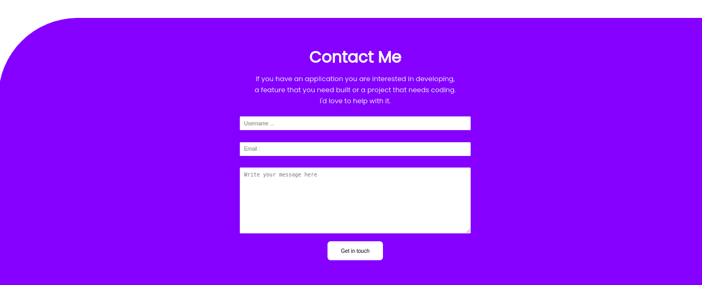

# Contact Form!

> A Portfolio project built with html/css with support for linters and web accessibility.

Additional description about the project and its features.

## Built With

- HTML
- CSS

## Live Demo

[Live Demo Link](https://livedemo.com)

## Getting Started

To get a local copy up and running follow these simple example steps.

## Author

Feel free to reach out. I'm always happy to connect :slightly_smiling_face:

👤 **Mkrtich Sargsyan**

[<code></code>](https://github.com/MkrtichSargsyan)
[<code></code>](https://twitter.com/MkrtichSargsyan)
[<code></code>](https://www.linkedin.com/in/mkrtich-sargsyan/)
[<code></code>](mailto:mkrtichsargsyan24@gmail.com)

## 🤝 Contributing

Contributions, issues, and feature requests are welcome!

Feel free to check the [issues page](../../issues/).

## Show your support

Give a ⭐️ if you like this project!

## Acknowledgments

- Hat tip to anyone whose code was used
- Inspiration
- etc

## 📝 License

This project is [MIT](./MIT.md) licensed.